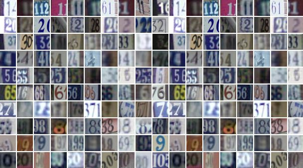

# Real-World Digit Classification with Neural Networks (SVHN Dataset)



## Overview

This project implements a **deep learning pipeline for classifying real-world digit images** using neural networks built with TensorFlow. The notebook demonstrates an **end-to-end machine learning workflow**, including:

* Data preprocessing
* Model building
* Training
* Validation
* Testing
* Model evaluation
* Saving the trained classifier

Two neural network architectures were implemented and compared:

* **Multilayer Perceptron (MLP)**
* **Convolutional Neural Network (CNN)**

The goal of this comparison is to analyze how model architecture influences performance in **image classification tasks involving real-world data**.

---

## Dataset

The project uses the **Street View House Numbers (SVHN) dataset**, a large real-world image dataset for digit recognition.

Dataset link:
[http://ufldl.stanford.edu/housenumbers/](http://ufldl.stanford.edu/housenumbers/)

Key characteristics of the dataset:

* Over **600,000 digit images**
* Images are cropped from **Google Street View house numbers**
* More challenging than the MNIST dataset because digits appear in **natural scene images**
* Each image belongs to one of **10 classes**

```
0, 1, 2, 3, 4, 5, 6, 7, 8, 9
```

---

## Project Objectives

This project aims to:

* Build a neural network pipeline for **real-world image classification**
* Compare the performance of **MLP and CNN architectures**
* Demonstrate the **full deep learning workflow using TensorFlow**
* Evaluate how model complexity affects classification performance

---

## Model Architectures

### Multilayer Perceptron (MLP)

A fully connected neural network used as a baseline model for digit classification.

Characteristics:

* Dense layers
* Non-linear activation functions
* Trained using backpropagation

While effective for simple datasets, MLPs generally perform worse on image data because they **do not capture spatial patterns**.

---

### Convolutional Neural Network (CNN)

A CNN architecture was implemented to improve performance on image data.

Characteristics:

* Convolutional layers
* Feature extraction using filters
* Pooling layers for spatial downsampling
* Fully connected classification layer

CNNs are better suited for image classification because they **learn spatial hierarchies of features**.

---

## Deep Learning Workflow

The project follows a standard **deep learning pipeline**:

1. Data loading and preprocessing
2. Dataset normalization
3. Model architecture definition
4. Model training
5. Validation during training
6. Performance evaluation on the test set
7. Model saving for later use

---

## Technologies Used

* Python
* TensorFlow
* NumPy
* Matplotlib
* Jupyter Notebook

---

## Repository Structure

```
project/
│
├── notebooks/
│   └── digit_classification.ipynb
│
├── models/
│   └── saved_model/
│
├── data/
│   └── dataset_link.md
│
├── results/
│   └── model_performance.png
│
└── README.md
```

---

## Results

The CNN model demonstrated **superior performance** compared to the MLP due to its ability to capture spatial features within images. The comparison highlights the importance of selecting appropriate architectures for computer vision tasks.

---

## Future Improvements

Potential improvements include:

* Implementing **data augmentation**
* Exploring deeper CNN architectures
* Applying **transfer learning**
* Hyperparameter optimization
* Testing additional architectures such as **ResNet or EfficientNet**

---

## Citation

Y. Netzer, T. Wang, A. Coates, A. Bissacco, B. Wu, and A. Y. Ng.
*"Reading Digits in Natural Images with Unsupervised Feature Learning."*
NIPS Workshop on Deep Learning and Unsupervised Feature Learning, 2011.

---

## License

This project is released for educational and research purposes.

---
